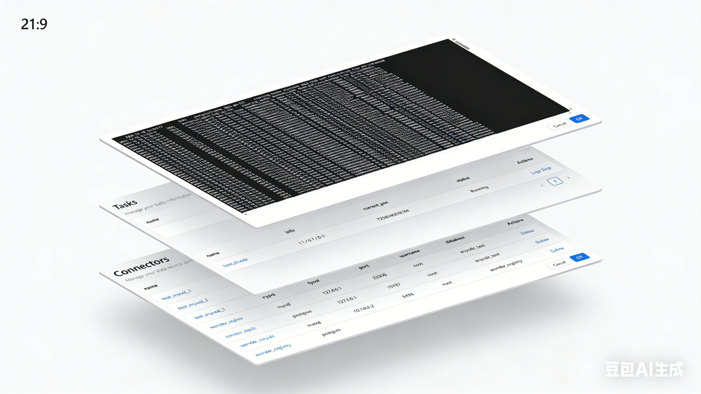

## Why AnyCDC

AnyCDC is a software designed for high-performance real-time heterogeneous database synchronization. 
It enables real-time data synchronization between different (or the same) databases through simple file configuration (in YAML format).

* **Real-Time Synchronization:** Leverages the native Event Streaming capabilities of databases (republication in PostgreSQL, Binlog in MySQL).
* **Multi Writers:** Supports synchronizing data to multiple target databases in a single task, similar to a broadcast mode.
* **Upsert Support:** Converts Insert operations from the source database into Upsert semantics, enabling event replay.
* **CDF (Custom Define Function):** Supports developing CDFs with JavaScript for advanced custom data transformation.
* **Partial Sync:** Minimizes the impact on synchronization tasks when DDL operations are performed on the source database.

## Keywords

In the current design objectives, `AnyCDC` is defined as a tool that leverages the native CDC (Change Data Capture) capabilities of databases (such as the widely adopted MySQL binlog) to synchronize data to other databases (and certainly supports homogeneous database synchronization). It adopts a multi-writer architecture, enabling more lightweight data broadcasting.
The design encompasses the following key technical concepts:
* **Connector:** Manages network connections to subscribed databases or storage components, including configurations such as host, port, username, and password.
* **Reader:** A component responsible for reading data from the source.
* **Writer:** A component responsible for writing data to the target.
* **Task:** A synchronization task consisting of one reader and one or more writers. Each task is defined in a separate file under the tasks directory.

## Supports Databases

Here are the types of databases we plan to support:

| Database | Reader | Writer |
| --- | --- | --- |
|PostgresSQL | Y| Y |
|MySQL | Y | Y |
|Elasticsearch | N | Y |
|StarRocks | N | Y |
|Clickhouse | N | Y |
|Kafka | N | Y |

## Development

* Install golang 1.24.5+
* Install docker & docker-compose
* Run tests/prepare.sh

